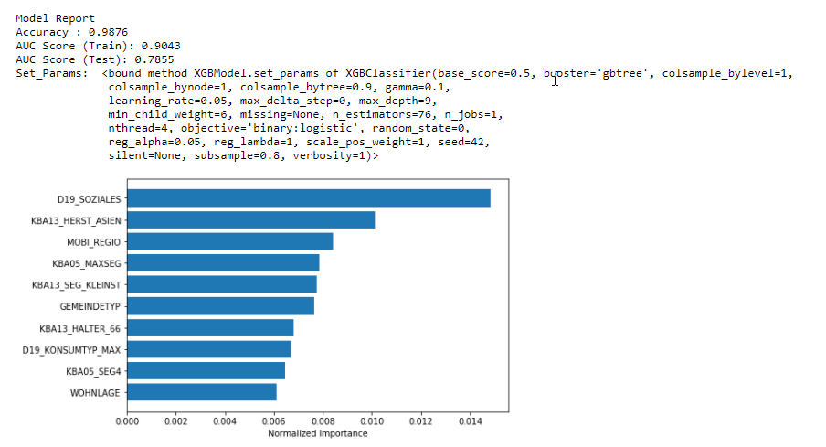
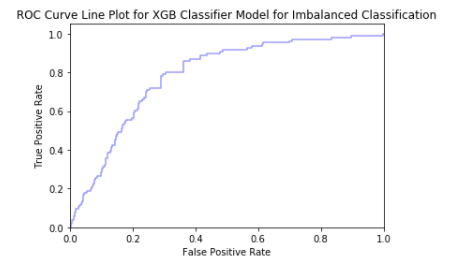
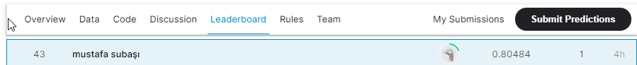

# Customer-Segmentation-and-Identify-Customers-for-Arvato-Financial-Services
This project is about the Capstone project for Udacity’s Data Scientist Nano Degree program. Project is based on the real-life data science problem and data is provided by Udacity’s partners at Bertelsmann Arvato Analytics. 

### The motivation for the project
Goal of this project is to identify which individuals are most likely to respond to the campaign and become customers of the mail-order company.

### Files description

The list of the files used in this project are:

#### Datas:

In this project we are provided with 4 datasets in total.
 - **Udacity_AZDIAS_052018.csv:** Demographics data for the general population of Germany; 891 211 persons (rows) x 366 features (columns).
 - **Udacity_CUSTOMERS_052018.csv:** Demographics data for customers of a mail-order company; 191 652 persons (rows) x 369 features (columns).
 - **Udacity_MAILOUT_052018_TRAIN.csv:** Demographics data for individuals who were targets of a marketing campaign; 42 982 persons (rows) x 367 (columns).
 - **Udacity_MAILOUT_052018_TEST.csv:** Demographics data for individuals who were targets of a marketing campaign; 42 833 persons (rows) x 366 (columns).

Also, two other datasets were highly important during the modeling process, DIAS Attributes — Values 2017.xlsx and DIAS Attributes — Values 2017.xlsx, which explain and detail features in the dataset.

#### Arvato Project Workbook.ipynb: 

This notebook includes all python codes of the Project Definition, Analysis, and Conclusion.

### Project Overview

We analyze demographics data for customers of a mail-order sales company in Germany, comparing it against demographics information for the general population. Then, we create customer segments of the general population to target with their marketing in order to grow and use a model to predict which individuals are most likely to convert into becoming customers for the company. 
In this project, there are 2 approach below mentioned;

- Unsupervised Learning to perform customer segmentation and identify clusters/segments from general population who best match mail-order company’s customer base.
- Supervised Learning to identify targets for marketing campaign of the mail-order company who could possibly become their customers.

Finally, we make predictions on the campaign data as part of a Kaggle Competition for rank the individuals by how likely they are to convert to being a customer.

### Project Steps

### Part 0: Get to Know the Data
- Load datas and Review of datas
- Data Cleaning and Feature Engineering
    - Modifying Existing Features to contain useful information
    - Addressing Unkown Values
    - Check and Handle Missing Values
    - Look at Column Types
    - Imputing Missing Values
    - Feature Scaling
    
### Part 1. Customer Segmentation Report
- Dimensionality Reduction
- Interpreting PCA Components
- Combine PCA and K-means Clustering

### Part 2. Supervised Learning Model
- Selecting the Evaluation Metric
- Cleaning data for Modelling
- Setting The Benchmark
- Trying out Different Models
- Grid Search
- Select Final Model
- Extras (Look at Final Model Optimal Thresholds and Confusion Matrix)

### Part 3: Kaggle Competition

### Results:

From the real life demographic data provided by Arvato Financials, we have been able to create segmentation of customers and also able to identify key features that will help identify customers for a company.

### Kaggle Submission

Final model was able to reach >80% score on the test set. Screenshot from leader board at the time of submission;

### Github Link:
https://github.com/mustafasubasi83

### Medium Link:
https://msub83.medium.com/who-is-become-a-customer-36797f56825c

### Kaggle Leaderboard:
https://www.kaggle.com/c/udacity-arvato-identify-customers/leaderboard

### Requirements

All of the requirements are given in requirements.txt. To install Run: pip install -r requirements.txt
